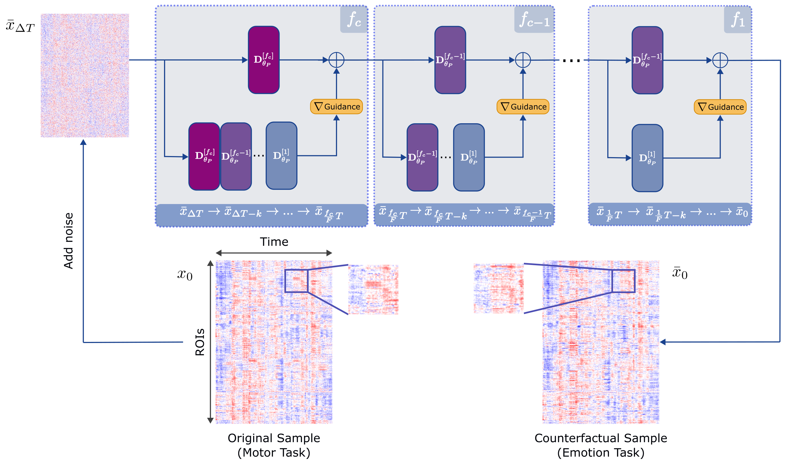
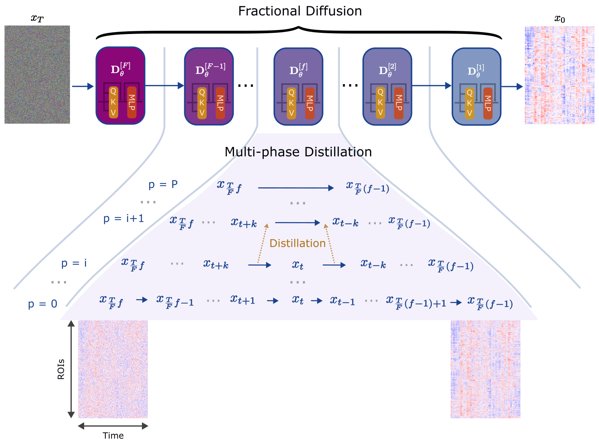
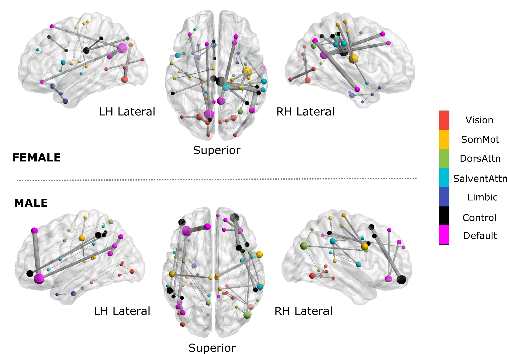

# **DreaMR**

## *Diffusion-driven Counterfactual Explanation for Functional MRI*

Official PyTorch implementation of DreaMR described in the [paper](https://arxiv.org/abs/2307.09547).

## Overall View

### Counterfactual Generation



### Training of the Diffusion Prior



## Running

### Dependencies

* python >= 3.7
* numpy >= 1.21.4
* torch >= 1.10.1
* torch-cuda >= 10.2
* torchvision >= 0.11.2
* tqdm >= 4.62.3

### Dataset
We use three datasets for our experiments in the paper, [HCP-Rest](https://db.humanconnectome.org/), [HCP-Task](https://db.humanconnectome.org/), [ID1000](https://openneuro.org/datasets/ds003097/versions/1.2.1) datasets. Due to privacy concerns, we are unable to share the datasets. But you can download them from their official sites.

But we provide a [dummy data loader](Dataset/Loaders/dummyLoader.py) to show what is expected by the [dataset.py](Dataset/dataset.py) file.

### Classifier Training

Here we provide an example [transformer based classifier](Classifiers/BolT/) ([official repo here](https://github.com/icon-lab/BolT)) which is used for the counterfactual generations.

``` python main.py --targetDataset datasetName --method bolT_classify --do train ```

Please note that you have to implement the dataset loader and do the required changes in the code to import your loader.
Also based on the dataset your using, set the correct variables (nOfClasses, dynamicLength) in the [main](main.py) file.

### Biomarker Identification



## Coming Soon...# DreaMR
